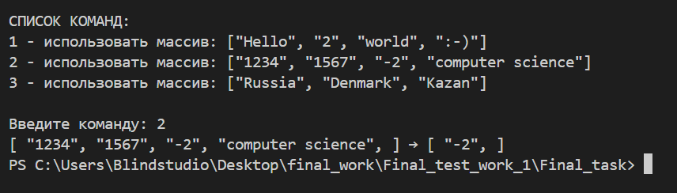

// Финальный тест
# ЗАДАЧА: 
Написать программу, которая из имеющегося массива строк формирует массив из строк, длина которых меньше либо равна 3 символа. Первоначальный массив можно ввести с клавиатуры, либо задать на старте выполнения алгоритма. При решение не рекомендуется пользоваться коллекциями, лучше обойтись исключительно массивами.

### Алгоритм выполнения задания:
1. Создать репозиторий на GitHub 
_*Готов!_*
2. Нарисовать блок-схему алгоритма
_*Блок схема прикреплена к заданию.Для удобства проверки разных массивов в программе, я использовалf switch, функции ввода/вывода в консоль.Они не указаны в блок-схеме._*

3. Снабдить репозиторий оформленным текстовым описанием решения (файл README.md)
_*Вы читаете файл README.md_*

4. Написать программу, решающую поставленную задачу/
_*В папке Task решение задачи на C#._*
Результат вывода в терминал:

5. Использовать контроль версий в работе над этим небольшим проектом (не должно быть так, что все залито одним коммитом, как минимум этапы 2, 3 и 4 должны быть расположены в разных коммитах)